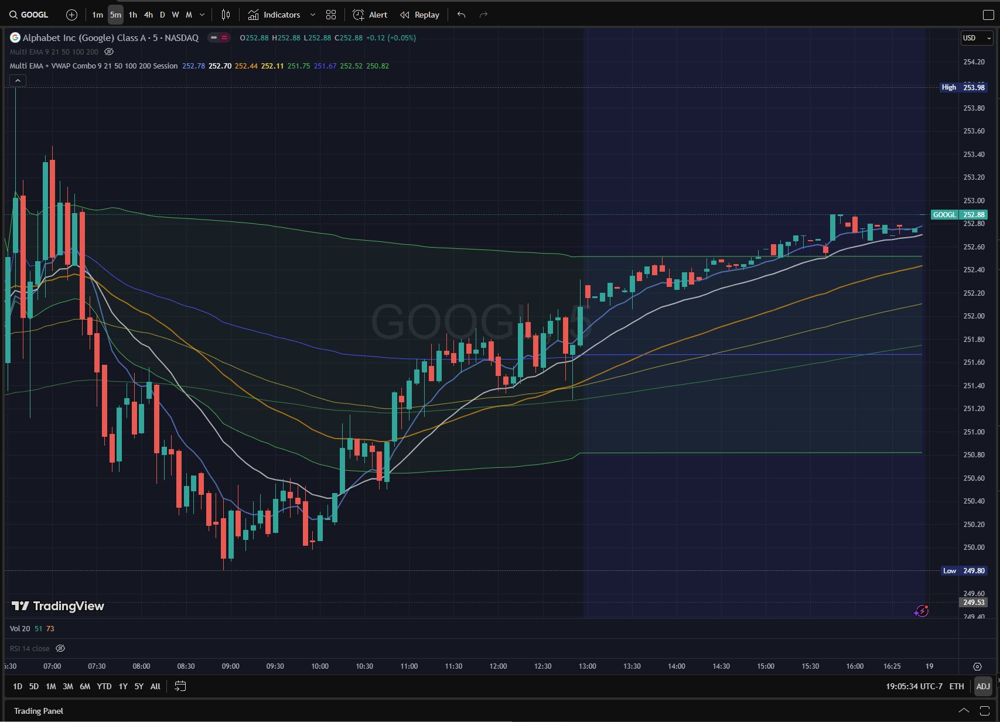

# Market Indicators and Strategies for TradingView

### About TradingView

TradingView is a trading platform that specializes in charts for stocks and other securities.  Traders can use the platform's built-in scripts to draw market indicators to their "supercharts".  Advanced traders can use [Pine Script](https://www.tradingview.com/pine-script-docs/welcome/), TradingView's custom programming language, to create their own custom trading indicators.

## My Custom Indicators and Strategies

### Combo Indicator

    

I've created a "combo indicator" that combines multiple indicators into a single indicator which can be added to TradingView.

#### Multi EMA

Set up to five Exponential Moving Average trails.  An EMA is a type of moving average that gives more weight to recent price data and less to older data, making it more responsive to price changes than a simple moving average (SMA).  EMAs can be used to determine trend direction, with a rising EMA suggesting an uptrend and a falling EMA indicating a downtrend.

Popular time periods that traders like to track are the 9, 20, 50, 100, and 200 time periods.

#### Volume Weighted Average Price (VWAP) ####

VWAP is a trading benchmark that reflects the average price of a security throughout a trading session, weighted by the volume of shares traded at different price levels.  It's calculated by summing the products of price and volume for each trade and dividing by the total volume for the period.  You can kind of think of it as a Moving Average which also takes into account the markets trading volume.

VWAP is only active for intraday charts (i.e. it won't work for daily charts or longer intervals).

## Benefits of Using This Combo Indicator

Traders on the Free membership tier of TradingView are only allowed to add 2 indicators.  However, traders often want to add more indicators to their charts.

For instance, traders who want to use an EMA indicator and a VWAP indicator quickly hit the max limit and cannot add more indicators they might want to use, such as "Relative Strength Index" (RSI) or "Moving Average Convergence and Divergence" (MACD).  By combining multiple indicators into a single indicator, your second allotted indicator slot can be freed up.

## How to Use in TradingView

1. From TradingView, open the Superchart.
2. Click the "Pine" button on the far-right vertical menu.
3. Copy/paste code from a Pine script into the empty web IDE text field.
4. Click the "Add to chart" button at the top.
5. The custom indicator should now appear on the chart.

